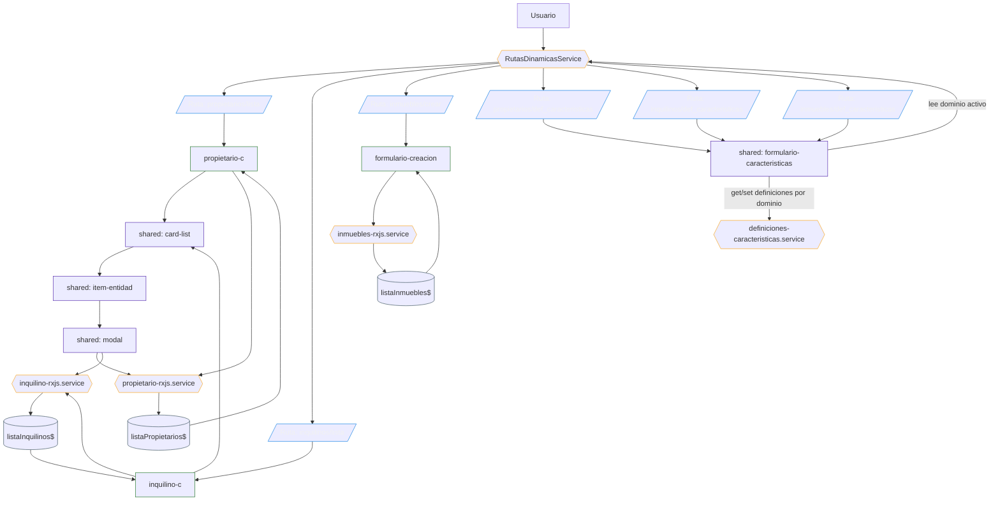

# Diagrama de Flujo General (estado actual)

```mermaid
flowchart TB

    %% Entrada comun
    U[Usuario]
    RDS{{RutasDinamicasService}}

    %% Rutas por dominio
    RP[/Ruta: propietarios/lista/]
    RI[/Ruta: inquilinos/lista/]
    RM[/Ruta: inmuebles/crear/]

    RDC1[/Ruta: propietarios/def_caracteristicas/]
    RDC2[/Ruta: inquilinos/def_caracteristicas/]
    RDC3[/Ruta: inmuebles/def_caracteristicas/]

    %% Componentes de dominio
    PC[propietario-c]
    IC[inquilino-c]
    FC[formulario-creacion]

    %% Shared UI
    CL[shared: card-list]
    IE[shared: item-entidad]
    FCS[shared: formulario-caracteristicas]
    MOD[shared: modal]

    %% Servicios de dominio
    SP{{propietario-rxjs.service}}
    SI{{inquilino-rxjs.service}}
    SM{{inmuebles-rxjs.service}}

    %% Servicio shared de definiciones
    SDEF{{definiciones-caracteristicas.service}}

    %% Estado observable
    OP[(listaPropietarios$)]
    OI[(listaInquilinos$)]
    OM[(listaInmuebles$)]

    %% Navegacion
    U --> RDS
    RDS --> RP
    RDS --> RI
    RDS --> RM
    RDS --> RDC1
    RDS --> RDC2
    RDS --> RDC3

    %% Flujos dominio propietarios
    RP --> PC
    PC --> CL
    CL --> IE
    IE --> MOD
    PC --> SP
    MOD --> SP
    SP --> OP
    OP --> PC

    %% Flujos dominio inquilinos
    RI --> IC
    IC --> CL
    IC --> SI
    MOD --> SI
    SI --> OI
    OI --> IC

    %% Flujos dominio inmuebles
    RM --> FC
    FC --> SM
    SM --> OM
    OM --> FC

    %% Flujo compartido de definiciones por dominio
    RDC1 --> FCS
    RDC2 --> FCS
    RDC3 --> FCS
    FCS -->|get/set definiciones por dominio| SDEF
    FCS -->|lee dominio activo| RDS

    %% Estilos
    classDef route stroke:#1E88E5,color:#f1f1f1;
    classDef component stroke:#2E7D32;
    classDef shared stroke:#5E35B1;
    classDef service stroke:#F9A825;
    classDef state stroke:#455A64;

    class RP,RI,RM,RDC1,RDC2,RDC3 route;
    class PC,IC,FC component;
    class CL,IE,FCS,MOD shared;
    class RDS,SP,SI,SM,SDEF service;
    class OP,OI,OM state;
```

