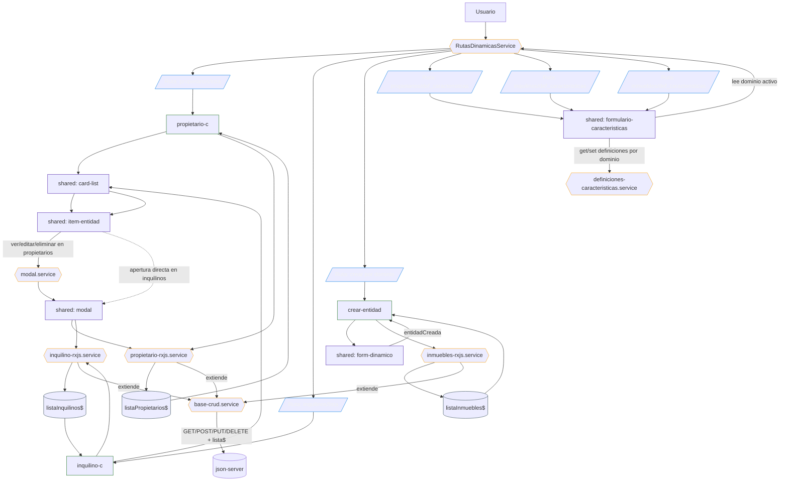

# Diagrama de Flujo General (arquitectura actual)

## Nota

Los servicios RxJS de cada entidad ya no repiten la lógica CRUD principal: `propietario-rxjs.service`, `inquilino-rxjs.service` e `inmuebles-rxjs.service` extienden [base-crud.service](/c:/Users/Octavio/Desktop/Desarrollo/mvpInmo/mvpInmo/src/app/core/http/base-crud.service), que centraliza `cargar`, `crear`, `actualizar`, `eliminar` y el `BehaviorSubject` `lista$`.

En la capa de modales ya existe [modal.service](/c:/Users/Octavio/Desktop/Desarrollo/mvpInmo/mvpInmo/src/app/core/modal/modal.service), que encapsula la apertura del modal compartido. Hoy su uso ya aparece en propietarios; inquilinos todavia conserva apertura directa con `MatDialog`, por eso el diagrama lo muestra como una transicion hacia un flujo mas homogeneo.
