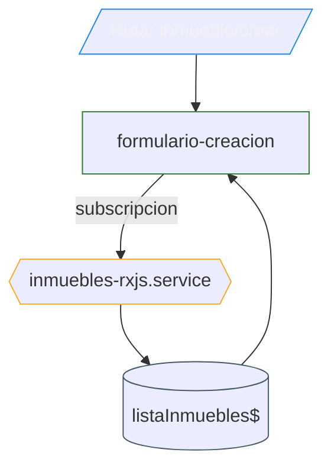

# Diagrama de Flujo — Dominio Inmueble (estado actual)

```mermaid
flowchart TB

    %% Rutas
    R1[/Ruta: inmueble/crear/]

    %% Componentes
    FC[formulario-creacion]

    %% Servicio
    S{{inmuebles-rxjs.service}}

    %% Estado
    O[(listaInmuebles$)]

    %% Flujos
    R1 --> FC

    FC -->|subscripcion| S

    S --> O

    O --> FC


    %% Estilos
    classDef route stroke:#1E88E5, color:#f1f1f1;
    classDef component stroke:#2E7D32;
    classDef service stroke:#F9A825;
    classDef state stroke:#455A64;

    class R1, route;
    class FC, component;
    class S service;
    class O state;

```
