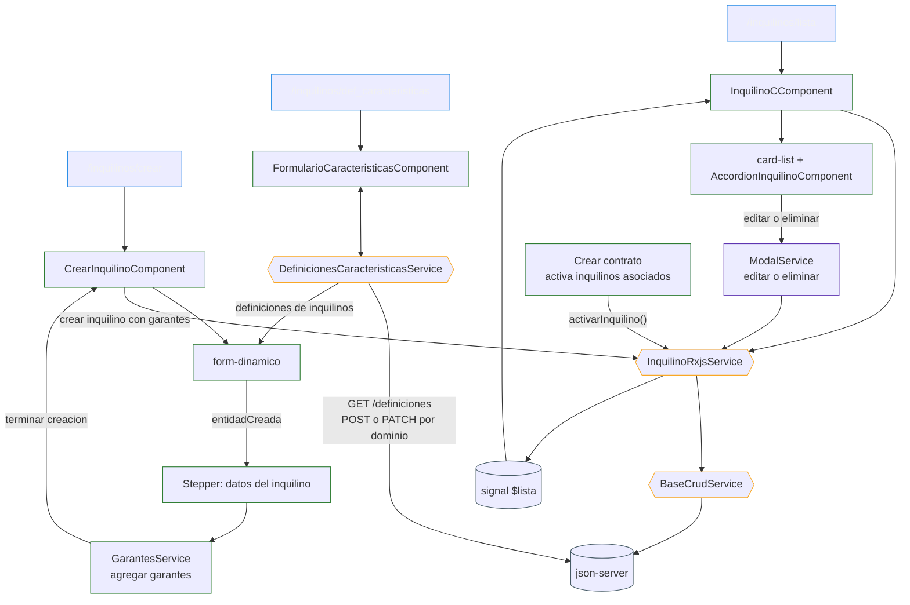

# Flujo del dominio Inquilinos

```mermaid
flowchart TB
    RLISTA["/inquilinos/lista"]
    RCREAR["/inquilinos/crear"]
    RDEF["/inquilinos/def_caracteristicas"]

    LISTA[InquilinoCComponent]
    CARD["card-list + AccordionInquilinoComponent"]
    MODAL["ModalService<br/>editar o eliminar"]
    CREAR[CrearInquilinoComponent]
    FD[form-dinamico]
    PASO["Stepper: datos del inquilino"]
    GARANTES["GarantesService<br/>agregar garantes"]
    SI{{InquilinoRxjsService}}
    CRUD{{BaseCrudService}}
    ESTADO[("signal $lista")]
    DEFINICIONES[FormularioCaracteristicasComponent]
    SDEF{{DefinicionesCaracteristicasService}}
    API[("json-server")]
    CONTRATO["Crear contrato<br/>activa inquilinos asociados"]

    RLISTA --> LISTA --> SI
    SI --> CRUD --> API
    SI --> ESTADO --> LISTA
    LISTA --> CARD
    CARD -->|"editar o eliminar"| MODAL
    MODAL --> SI

    RCREAR --> CREAR --> FD
    FD -->|"entidadCreada"| PASO
    PASO --> GARANTES
    GARANTES -->|"terminar creacion"| CREAR
    CREAR -->|"crear inquilino con garantes"| SI
    CONTRATO -->|"activarInquilino()"| SI

    RDEF --> DEFINICIONES
    DEFINICIONES <--> SDEF
    SDEF -->|"GET /definiciones<br/>POST o PATCH por dominio"| API
    SDEF -->|"definiciones de inquilinos"| FD

    classDef route stroke:#1E88E5,color:#f1f1f1;
    classDef component stroke:#2E7D32;
    classDef shared stroke:#5E35B1;
    classDef service stroke:#F9A825;
    classDef state stroke:#455A64;

    class RLISTA,RCREAR,RDEF route;
    class LISTA,CARD,CREAR,FD,PASO,GARANTES,DEFINICIONES,CONTRATO component;
    class MODAL shared;
    class SI,CRUD,SDEF service;
    class ESTADO,API state;
```

El alta no termina al enviar las caracteristicas: el formulario pasa al paso de garantes y recien despues persiste el inquilino.
