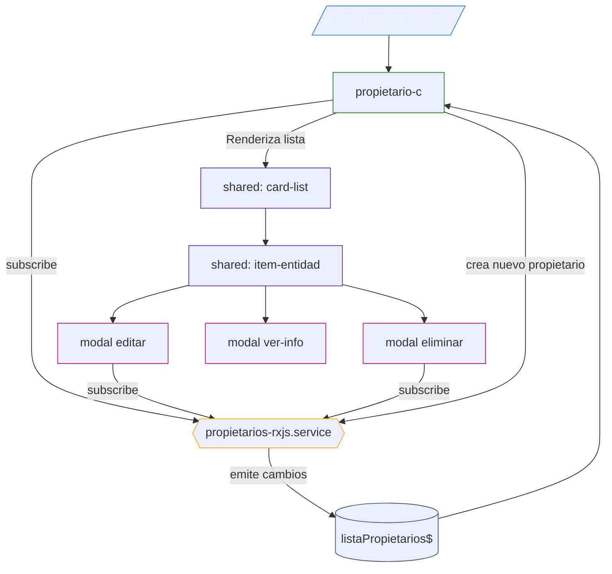

# Diagrama de Flujo — Dominio Propietarios (estado actual)

```mermaid
flowchart TB

    %% Rutas
    R1[/Ruta: propietario/lista/]

    %% Componentes
    PC[propietario-c]

    %% Shared
    CL[shared: card-list]
    IE[shared: item-entidad]

    %% Modales
    ME[modal editar]
    MD[modal eliminar]
    MI[modal ver-info]

    %% Servicio
    S{{propietarios-rxjs.service}}

    %% Estado
    O[(listaPropietarios$)]

    %% Flujos
    R1 --> PC

    PC -->|Renderiza lista| CL
    CL --> IE

    IE --> ME
    IE --> MD
    IE --> MI

    PC -->|subscribe| S
    ME -->|subscribe| S
    MD -->|subscribe| S

    PC -->|crea nuevo propietario| S

    S -->|emite cambios| O
    O --> PC

    %% Estilos
    classDef route stroke:#1E88E5, color:#f1f1f1;
    classDef component stroke:#2E7D32;
    classDef service stroke:#F9A825;
    classDef modal stroke:#C2185B;
    classDef shared stroke:#5E35B1;
    classDef state stroke:#455A64;

    class R1,R2 route;
    class PC,IP component;
    class CL,IE shared;
    class ME,MD,MI modal;
    class S service;
    class O state;

```
