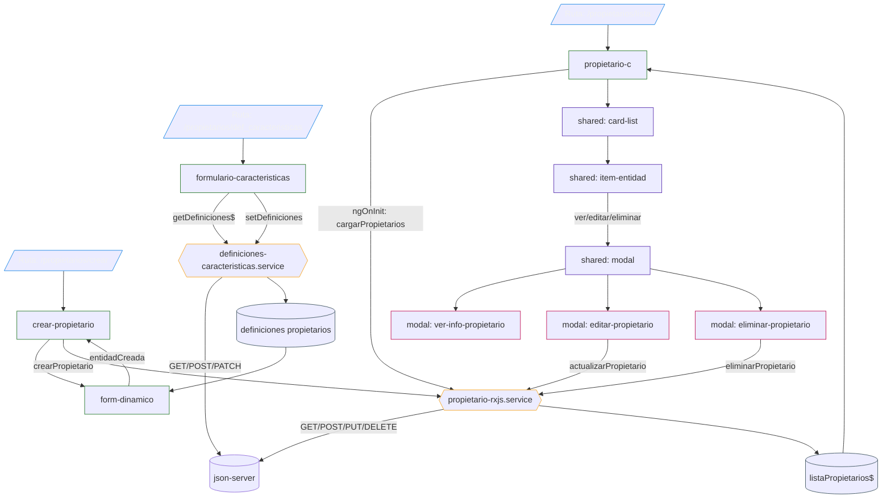

# Diagrama de Flujo - Dominio Propietarios (actualizado)

```mermaid
flowchart TB
    %% Rutas
    RLISTA[/Ruta: /propietarios/lista/]
    RCREAR[/Ruta: /propietarios/crear/]
    RDEF[/Ruta: /propietarios/def_caracteristicas/]

    %% Componentes
    LC[propietario-c]
    CC[crear-propietario]
    FD[form-dinamico]
    FC[formulario-caracteristicas]
    CL[shared: card-list]
    IE[shared: item-entidad]
    MOD[shared: modal]
    MV[modal: ver-info-propietario]
    ME[modal: editar-propietario]
    MD[modal: eliminar-propietario]

    %% Servicios y estado
    SP{{propietario-rxjs.service}}
    SD{{definiciones-caracteristicas.service}}
    EP[(listaPropietarios$)]
    ED[(definiciones propietarios)]

    %% Lista
    RLISTA --> LC
    LC -->|ngOnInit: cargarPropietarios| SP
    SP -->|GET/POST/PUT/DELETE| API[(json-server)]
    SP --> EP
    EP --> LC
    LC --> CL --> IE
    IE -->|ver/editar/eliminar| MOD
    MOD --> MV
    MOD --> ME
    MOD --> MD
    ME -->|actualizarPropietario| SP
    MD -->|eliminarPropietario| SP

    %% Crear
    RCREAR --> CC --> FD
    FD -->|entidadCreada| CC
    CC -->|crearPropietario| SP

    %% Definiciones de caracteristicas
    RDEF --> FC
    FC -->|getDefiniciones$| SD
    FC -->|setDefiniciones| SD
    SD -->|GET/POST/PATCH| API
    SD --> ED
    ED --> FD

    %% Estilos
    classDef route stroke:#1E88E5,color:#f1f1f1;
    classDef component stroke:#2E7D32;
    classDef service stroke:#F9A825;
    classDef modal stroke:#C2185B;
    classDef shared stroke:#5E35B1;
    classDef state stroke:#455A64;

    class RLISTA,RCREAR,RDEF route;
    class LC,CC,FD,FC component;
    class CL,IE,MOD shared;
    class MV,ME,MD modal;
    class SP,SD service;
    class EP,ED state;
```
