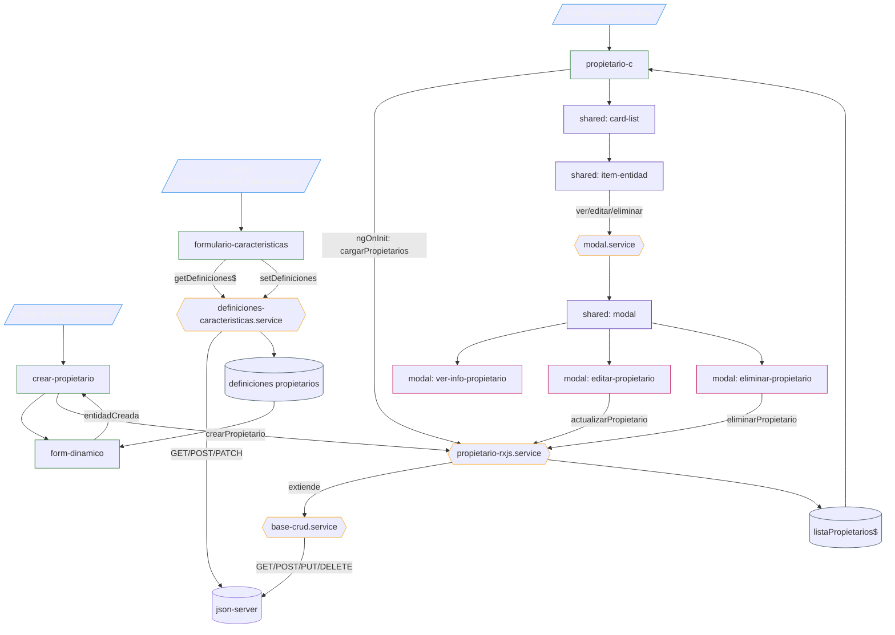

# Diagrama de Flujo - Dominio Propietarios (patron reutilizable)

## Nota

Este flujo ya representa mejor el patron que se repite en las demas entidades:

- el componente de lista consume el observable expuesto por el servicio RxJS de su dominio
- el servicio de dominio delega el CRUD comun en [base-crud.service](/c:/Users/Octavio/Desktop/Desarrollo/mvpInmo/mvpInmo/src/app/core/http/base-crud.service)
- la apertura de modales se centraliza en [modal.service](/c:/Users/Octavio/Desktop/Desarrollo/mvpInmo/mvpInmo/src/app/core/modal/modal.service)
- la ruta de creacion reutiliza `form-dinamico` y las definiciones compartidas del dominio
