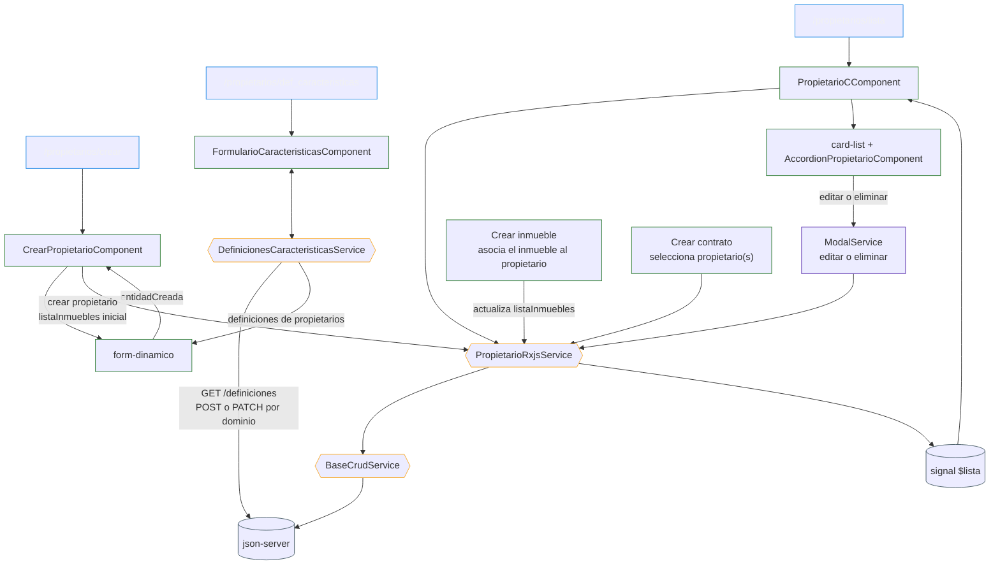

# Flujo del dominio Propietarios

```mermaid
flowchart TB
    RLISTA["/propietarios/lista"]
    RCREAR["/propietarios/crear"]
    RDEF["/propietarios/def_caracteristicas"]

    LISTA[PropietarioCComponent]
    CARD["card-list + AccordionPropietarioComponent"]
    MODAL["ModalService<br/>editar o eliminar"]
    CREAR[CrearPropietarioComponent]
    FD[form-dinamico]
    SP{{PropietarioRxjsService}}
    CRUD{{BaseCrudService}}
    ESTADO[("signal $lista")]
    DEFINICIONES[FormularioCaracteristicasComponent]
    SDEF{{DefinicionesCaracteristicasService}}
    API[("json-server")]
    INMUEBLE["Crear inmueble<br/>asocia el inmueble al propietario"]
    CONTRATO["Crear contrato<br/>selecciona propietario(s)"]

    RLISTA --> LISTA --> SP
    SP --> CRUD --> API
    SP --> ESTADO --> LISTA
    LISTA --> CARD
    CARD -->|"editar o eliminar"| MODAL
    MODAL --> SP

    RCREAR --> CREAR --> FD
    FD -->|"entidadCreada"| CREAR
    CREAR -->|"crear propietario<br/>listaInmuebles inicial"| SP
    INMUEBLE -->|"actualiza listaInmuebles"| SP
    CONTRATO --> SP

    RDEF --> DEFINICIONES
    DEFINICIONES <--> SDEF
    SDEF -->|"GET /definiciones<br/>POST o PATCH por dominio"| API
    SDEF -->|"definiciones de propietarios"| FD

    classDef route stroke:#1E88E5,color:#f1f1f1;
    classDef component stroke:#2E7D32;
    classDef shared stroke:#5E35B1;
    classDef service stroke:#F9A825;
    classDef state stroke:#455A64;

    class RLISTA,RCREAR,RDEF route;
    class LISTA,CARD,CREAR,FD,DEFINICIONES,INMUEBLE,CONTRATO component;
    class MODAL shared;
    class SP,CRUD,SDEF service;
    class ESTADO,API state;
```

El propietario se vincula con sus inmuebles mediante `listaInmuebles`; el alta de un inmueble actualiza esa lista. Tambien puede asociarse a contratos.
